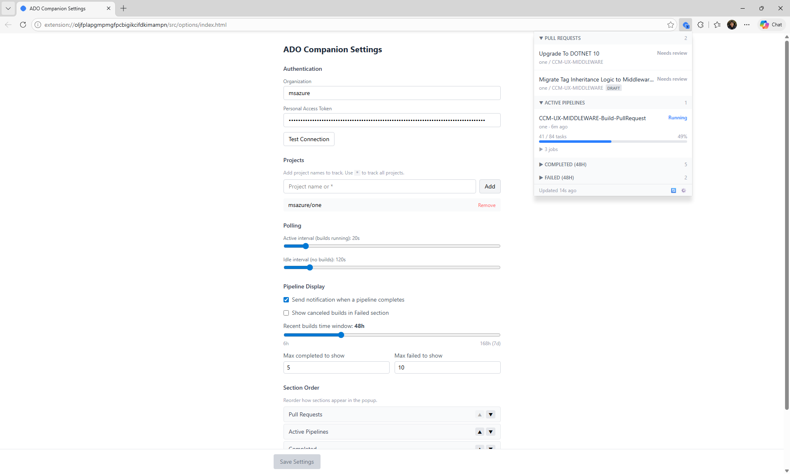

# ADO Companion

Chrome/Edge browser extension that surfaces Azure DevOps pull requests and pipeline progress at a glance.



## Features

- **Running Pipelines** — task-level progress for your active builds with job breakdown
- **Pull Requests** — track your open PRs with status and draft indicators
- **Pipeline Notifications** — get notified when a build completes, fails, or is canceled
- **Build Tracking** — visit any ADO build page and opt in to watch it from the popup
- **Bookmark Management** — optionally sync PRs to a browser bookmark folder
- **Hybrid Polling** — faster refresh when builds are active, slower when idle
- **PAT Authentication** — works with short-lived personal access tokens

## Installation

### Prerequisites

- [Node.js](https://nodejs.org/) v18 or later
- [pnpm](https://pnpm.io/) v10 or later (`npm install -g pnpm` if you don't have it)
- A Chromium-based browser (Chrome, Edge, Brave, Arc, etc.)

### 1. Clone and build

```bash
git clone https://github.com/kinnerparikh/ado-companion.git
cd ado-companion
pnpm install
pnpm build
```

This compiles everything into the `dist/` folder.

### 2. Load the extension

1. Open your browser and navigate to the extensions page:
   - **Chrome**: `chrome://extensions`
   - **Edge**: `edge://extensions`
2. Enable **Developer mode** (toggle in the top-right corner).
3. Click **Load unpacked**.
4. Select the `dist/` folder inside the cloned repository.
5. The ADO Companion icon will appear in your browser toolbar. Pin it for quick access.

### 3. Generate a Personal Access Token (PAT)

The extension authenticates with Azure DevOps using a PAT.

1. Go to your [Azure DevOps User Settings → Personal Access Tokens](https://dev.azure.com/msazure/_usersSettings/tokens) (replace `msazure` with your organization if different).
2. Click **+ New Token**.
3. Give it a name (e.g. `ADO Companion`).
4. Set the expiration (7 days is fine — the extension will warn you when it expires).
5. Under **Scopes**, grant at minimum:
   - **Build** → Read
   - **Code** → Read
6. Click **Create** and copy the token.

### 4. Configure the extension

1. Click the ADO Companion icon in the toolbar, then click the ⚙️ gear icon to open **Settings** (or right-click the icon → **Options**).
2. Enter your Azure DevOps **Organization** name (e.g. `msazure`).
3. Paste your PAT and click **Log In**. The extension will validate the token against the ADO API.
4. Under **Projects**, add the project names you want to track (or enter `*` to track all projects in the organization).
5. Click **Save Settings**.

The popup will begin showing your active pipelines and pull requests within a few seconds.

### 5. Optional configuration

All of these are available on the Settings page:

| Setting | Description |
|---------|-------------|
| **Polling intervals** | How often to check for updates when builds are running (default 20s) vs idle (default 120s) |
| **Pipeline notifications** | Get a browser notification when a build completes |
| **Show canceled builds** | Include canceled builds in the Failed section |
| **Recent builds time window** | How far back to show completed/failed builds (6h–7d) |
| **Max completed / failed** | Cap how many recent builds appear in each section |
| **Section order** | Drag sections to reorder how they appear in the popup |

### Updating the extension

After pulling new changes, rebuild and reload:

```bash
git pull
pnpm install
pnpm build
```

Then go to your extensions page and click the **reload** button (🔄) on the ADO Companion card.

## Development

| Command | Description |
|---------|-------------|
| `pnpm dev:harness` | Dev harness with mock data and HMR |
| `pnpm dev` | Build extension in watch mode |
| `pnpm build` | Production build |
| `pnpm test` | Run Vitest tests |
| `pnpm test:watch` | Vitest in watch mode |

The **dev harness** (`pnpm dev:harness`) renders the popup and options page outside the extension context with mock Chrome APIs and scenario switching (connected, disconnected, PAT expired, etc.).

## Stack

React · TypeScript · Tailwind CSS · Vite · Manifest V3 · Vitest
